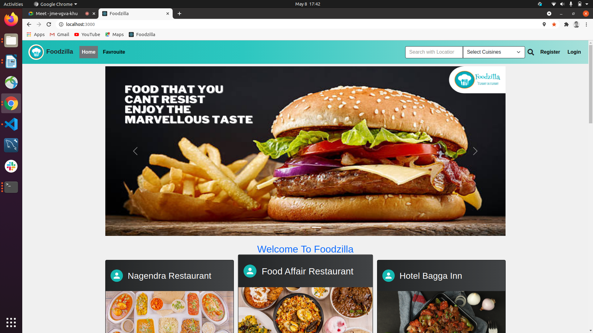
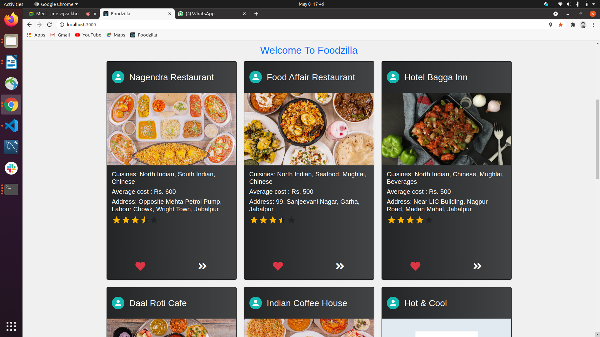
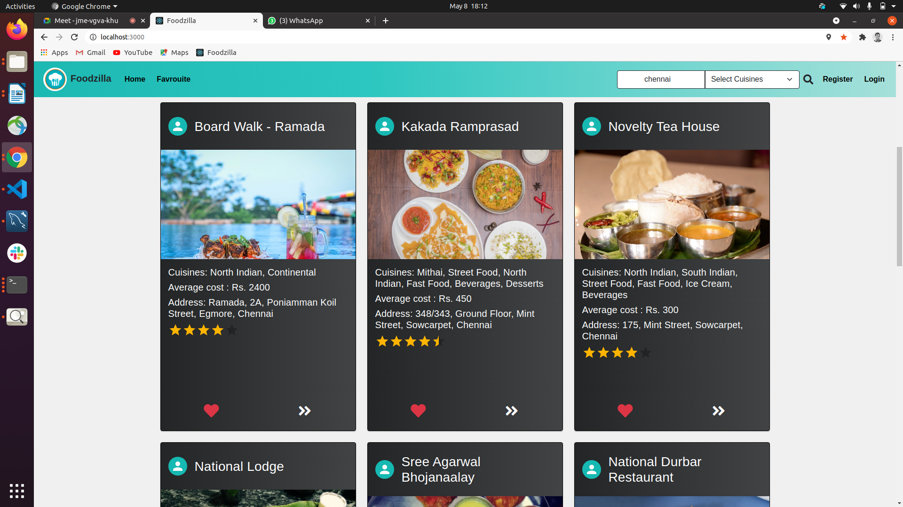
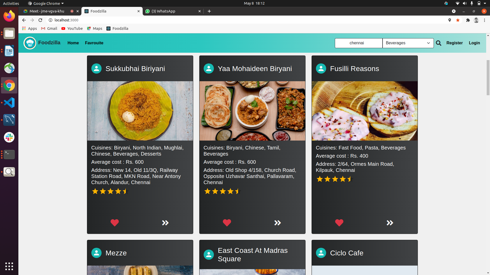
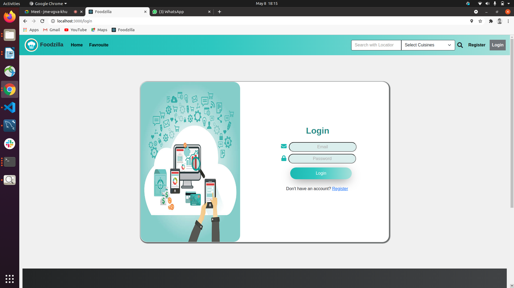
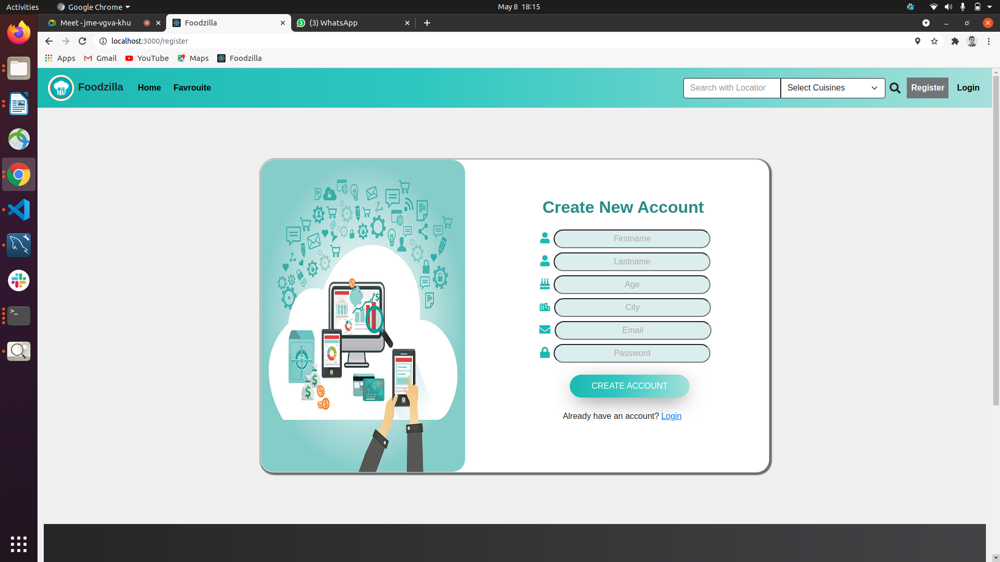
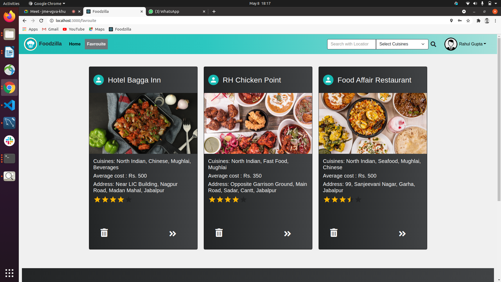
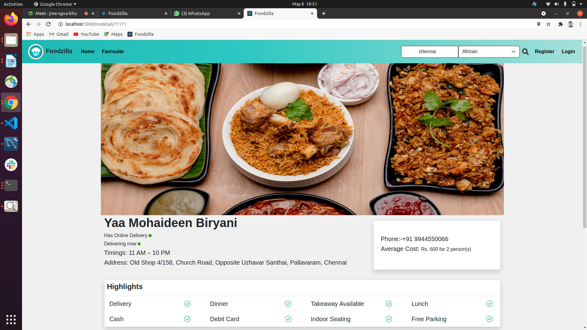

**Introduction**

Foodzilla offers a relaxed way to discover the best food deals and restaurants to eat near you. If you allow it, the application can locate the closest restaurants just by using your location. However, if you already have a place in mind, type in the location , select the cuisine you are craving for and let it work for you!

The geolocation  consists of a list of places registered in the server memory. The restaurant data is stored on the server and device is used to access it in order to display to the user.

It consists of a user login and registration that allows user to add and access their favourite restaurants. After successful addition, the restaurants get stored along with their name, location, rating and description in the server. The user allows the system to access their current location and will be able to get the data of restuarants. The application then allows user to access the restaurants from other locations as well. The user on logging in can save their favourite restaurants by adding them to their favourties and refer that page for a quick search.

Furthermore, Foodzilla is not only making sure that you don’t get hungry, but also finds the information about online delivery and open for delivery restaurants, and reviews for them all. A person can find all the information that they might need, such as opening and serving hours, phone numbers, highlights and much more!

**Objective/Vision**

Build a system where users can find different cuisines in a single App like Zomato App.

To make it user friendly for all internet users.

The Prime objective of “Foodzilla” is to create a full fledged web application which could locate a list of restaurants based on the location & type of the cuisine entered by the user. The user not only finds all the restaurant in the city, but also he can make a choice of the best restaurant based on the rating. The user has the facility to make a call directly to the restaurant and can also obtain the detailed review provided by the others users.

**System requirement specification**

**Functional requirement**

- User should be able to register in the system.A registered user should be able to login to the system
- Search for the restuarants and cuisines based on the location
- Favourite service – user should be able to add his favorite cuisine or resturant and same will be displayed on Favourites.

**Non-Functional requirement**

- App should be responsive to display consistently across multiple device screens.

- Dockerize the front-end (create Docker file, docker-compose.yml and get it executed through docker compose)

**Implementation**

The user interface is kept simple and understandable. The user need not take any additional effort to understand the functionality and navigation in the application. The colors are chosen in such a way that user can easily understand where the input has to be given. Hints are given to help the user in giving the correct input. The following are the main screens and features in this application.

- Home
- Favourites
- Restaurant details
- Register
- Login
- Search

**Home**

As soon you launch the app this screen will appear first. In this screen you will find all the restaurants specific to user’s current location.

The user can also find the restaurant on the basis of location adn cuisines entered in the search bar. Before the data loads, loading screen appears on home page. The user can view the restaurant details on clicking more details. The user has been given the facility to add their favourite restaurant which requires the user to login with their credentials.

**Favourites**

**	This section requires the user to login to the application, after which it displays the user’s favourite restaurants. User has the freedom to add as many favourites as they want. The user can add a restaurant to their favourite based on their experience or on rating. From favourite section, user can view the restaurant details which gives brief summary about the restaurant and also delete a restaurant which is no longer their favourite.

**Restaurant details**

This section helps the user by giving the complete information of a particular restaurant. The user can also see the status of online delivery and if the restuarant is delivering at the moment.It contains other information such as phone number and facilities of the restaurant which helps the user to decide which restuarant to go.

**Register**

**	Register is used to sign up the user to our application. It requires parameters like name, age, city, email and password.

**Login**

Login requires the user to login the application with proper and already registered credentials. If the user doesn’t have an account, they can use the application by signing up. Login credentials is required by the user only when they want to use favourites section of the application

**Search**

**	Search section helps the user to find the restaurants based on the location and cuisines. Location is required to have correct spelling, without which it will show no data page. Cuisines can be selected through dropdown list which is already defined. On search, if the location is empty, the application takes the user’s current location.

**Tools and Technology used**

- VCS : Github
- Editor: VS Code
- Frond end : React, Bootstrap, React Material UI
- Data Store : JSON Server/ Custom
- Testing : React Testing library, Jest, Cypress
- Containerization: Docker
- Image Editing: Canvas,Photoshop

**User Manual**

This application can be used all internet users. The following are the steps that user has to follow to use the application

**Step 1**: As soon as the user open the application, they can see the below home page which consists of restaurant in current location.

1.a.Home page

1.b.Lists of restaurants

**Step 2**: User can search for the restaurant based on different location and cuisine as well

2.a User search based on location

2.b. User search based on location and cuisine

**Step 3**:If the user clicks add to favourite, they will be redirected to login page if they are not logged in already

3.a. Login page

**Step 4**: If the user is not registered, they can register through register page by giving the required parameters in correct format for example, the password should be of length greater than 6

4.a. Register page

**Step 5**: After loggin in , the user can access favourites section where there is a collection of all the user’s top choice.

5.a. Favourites page

**Step 6**: On clicking the more details button, user can view the restaurant details which has status of online delivery , phone number, facilities of restaurant and many more

6.a. Restaurant details page

**Highlights of the application**

- User can easily reach the restaurant by using application
- This application will be in user’s device. So, user can use this  application anywhere
- This application helps user to find best restaurants with the help of ratings and facilities
- The user need not take any additional effort to understand the functionality and navigation in the application
- The ability of the user to add a favourite restaurant helps in quick search of their most liked places.
- The user interface is simple and easy to understand.

**Conclusion**

During the course of this project there are many finding that we have come across. In big cities like Delhi, Mumbai, Bangalore etc majority of population are of professional, industrialist etc who have got money but less time to waste. These type of community people usually have their breakfast, lunch and dinner outside as they have no time to cook or they are bachelors or both husband and wife are working. What problem they come across is that they have got very less time so they go to whichever restaurant they find first. What happens after getting into the restaurant is either they don’t like the food or if the food is good then they have to pay more for the same taste of food available nearby that restaurant that to with great ambience. This finding really motivated us to make an application for this community so that we can save both their time as well as money.

But later on we realized that other communities like that of students, workers etc can also find this application useful and that give us idea to put a search box as well for specific finding by the user. The most important data of Restaurant information is the ratings.
